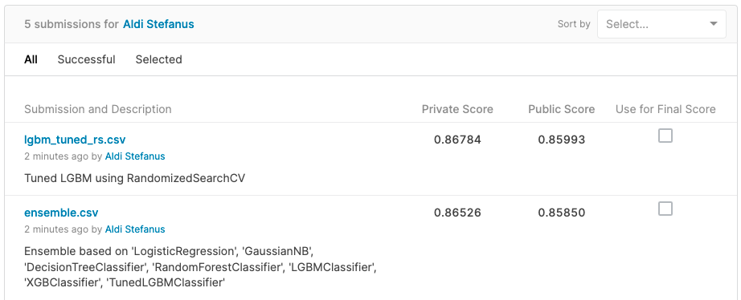
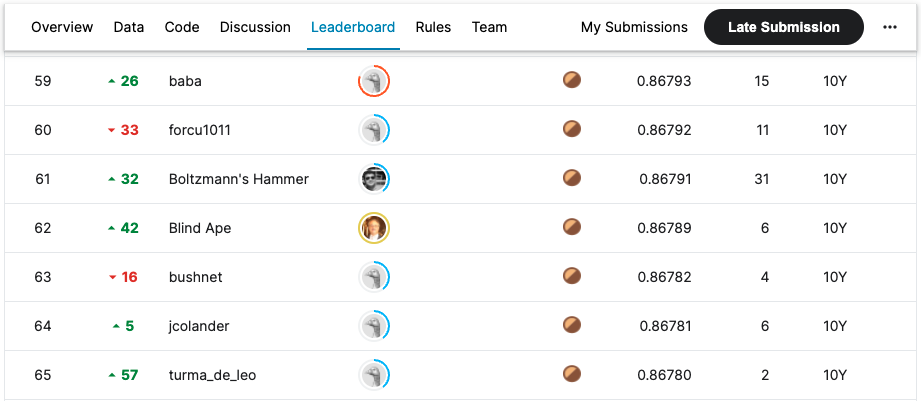

# kaggle_givemesomecredit_apr2022

This assignment is based on the Kaggle competition [GiveMeSomeCredit](https://www.kaggle.com/competitions/GiveMeSomeCredit).
Data and descriptions can be found in the link above.

Analysis, modeling and answers to questions can be found the notebook file [analysis_and_modeling.ipynb](./analysis_and_modeling.ipynb)

The final modeling approach using tuned Light GBM was able to get into the top 100 private leaderboard:



WIth the score of `0.86784`, the submission will beat the 63th private leaderboard position at `0.86782`.



## Folder Structure

```
.
├── Dockerfile-analysis
├── Dockerfile-serving
├── Makefile
├── README.md
├── analysis_and_modeling.ipynb
├── data
│   ├── Data Dictionary.xls
│   ├── cs-test.csv
│   ├── cs-training.csv
│   └── sampleEntry.csv
├── kaggle_screenshots
│   ├── leaderboard.png
│   └── submissions.png
├── main.py
├── requirements-analysis.txt
├── requirements-serving.txt
├── src
│   ├── __init__.py
│   ├── constants.py
│   ├── eda
│   ├── formatters
│   ├── preprocessing
│   ├── routes
│   ├── services
│   ├── train
│   ├── train_artifacts (saved imputer, cap dict and trained model)
│   └── utils.py
└── submissions
    ├── ensemble.csv
    └── lgbm_tuned_rs.csv
```

## Setting up the environment

This repository provides two environments. One for analysis and modeling, and the other one for serving.
You can either use an environment manager like `conda` or run using `docker`. These two options has been wrapped in the `Makefile`:

### Analysis

- `Dockerfile-analysis`
- `requirements-analysis.txt`

To create the analysis environment using `conda`:

```bash
make create_conda_dev
conda activate givemesomecredit_aldisf_dev
pip install -r requirements-analysis.txt
jupyter lab
```

To run the analysis environment using `docker` (note that this will automatically spin up a jupyter lab server in the terminal,
and you can directly follow the link to open the jupyter lab environment):

```bash
make run_jupyter_dev
```

### Serving

- `Dockerfile-serving`
- `requirements-serving.txt`

Note that these commands will start a uvicorn-FastAPI server at port 8888. You can follow the link shown in the terminal to
open the root route of the API, and you can append `/docs` at the end to see the Swagger UI, which you can visit here
once you have started the server as well: [Swagger UI](http://127.0.0.1:8888/docs).

```bash
make create_conda_serving
conda activate givemesomecredit_aldisf_serving
pip install -r requirements-serving.txt
make start_server
```

To launch the serving using `docker`:
```bash
make serve
```

For both usage using `conda` and `docker`, once you have started the server, you can
open up a new terminal window and tries an example request using the command:

```bash
curl -X 'POST' \
  'http://127.0.0.1:8888/delinquency/delinquency' \
  -H 'accept: application/json' \
  -H 'Content-Type: application/json' \
  -d '{
  "RevolvingUtilizationOfUnsecuredLines": 0.88551908,
  "age": 43,
  "NumberOfTime30_59DaysPastDueNotWorse": 0,
  "DebtRatio": 0.177512717,
  "MonthlyIncome": 5700,
  "NumberOfOpenCreditLinesAndLoans": 4,
  "NumberOfTimes90DaysLate": 0,
  "NumberRealEstateLoansOrLines": 0,
  "NumberOfTime60_89DaysPastDueNotWorse": 0,
  "NumberOfDependents": 0
}'
```

Which has been wrapped in the `Makefile` as well, and you can call it via:

```bash
make example_request
```

Or you can try out the API via the Swagger UI linked above. The expected response then will be:
```
{
    "DefaultProb":0.05612784857941346,
    "metadata":
        {
            "RevolvingUtilizationOfUnsecuredLines":0.88551908,
            "age":43,
            "NumberOfTime30_59DaysPastDueNotWorse":0,
            "DebtRatio":0.177512717,
            "MonthlyIncome":5700.0,
            "NumberOfOpenCreditLinesAndLoans":4,
            "NumberOfTimes90DaysLate":0,
            "NumberRealEstateLoansOrLines":0,
            "NumberOfTime60_89DaysPastDueNotWorse":0,
            "NumberOfDependents":0.0
        }
}
```
